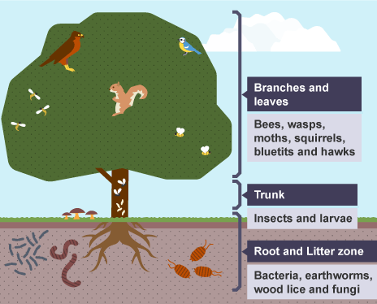

# Repository developed for the BioInference 2026 Reproducibility Award.

## Overview

This repository contains the R code used for niche analysis presented at BioInference 2026 at The University of St Andrews.

My research uses mathematical and statistical modelling to shed light on the relationship between soil biodiversity, its geographical distribution, its variation among diverse land uses, and how climate change affects it. 

The workflow compares environmental niche overlap among Mesofauna, Macrofauna, and Earthworms using environmental data and Schoener's D niche - overlap metrics implemented through the `ecospat` package.

The analysis measures overlap in environmental niche space and provides visual and quantitative comparisons among the different soil - fauna groups.

## What is an Ecological Niche?

An ecological niche describes the environmental conditions and resources that allow a species or group of organisms to survive, grow, and reproduce.



*Image source: BBC Bitesize. https://www.bbc.co.uk/bitesize/guides/z2vjrwx/revision/4*

## Data Availability

The original research dataset cannot be shared publicly because it is part of ongoing research.

To support reproducibility, a synthetic example dataset is included in this repository. The example dataset has the same structure as the original dataset but contains artificially generated values and should not be interpreted biologically.

The synthetic dataset allows users to run the complete workflow from beginning to end and reproduce all example outputs included in this repository.

## Repository Contents

* `Niche_Analysis_Ecospat.R` – main analysis script.
* `example_data/` – synthetic dataset used for demonstration and testing.
* `outputs/` – outputs generated from the synthetic dataset.

  * `schoeners_D.csv`
  * `niche_overlap_dummy_data.png`
  * `sessionInfo.txt`
* `LICENSE` – MIT License.

## Software Requirements

The following packages are necessary for the analysis, which was created in R:

| Package | Purpose in the analysis                                                           |
| ------- | --------------------------------------------------------------------------------- |
| readxl  | Reads the Excel file containing environmental and fauna datasets              |
| dplyr   | Data manipulation                     |
| tidyr   | Data reshaping and handling missing values                                        |
| stringr | Cleaning and standardising text fields and column names                           |
| janitor | Cleaning and standardising imported column names                                  |
| ggplot2 | Plotting and data visualisation                                           |
| ade4    | Principal Component Analysis (PCA) of environmental variables                     |
| ecospat | Construction of niche grids and calculation of Schoener's D niche-overlap metrics |
| readr   | Robust numeric parsing and export of output tables                                |

Missing packages are installed automatically when the script is run.

## How to Run the Analysis

### Step 1: Download the Repository

Download or clone this repository to your local computer.

### Step 2: Open R or RStudio

Open the script:

`Niche_Analysis_Ecospat.R`

### Step 3: Run the Analysis

Execute:

```r
source("Niche_Analysis_Ecospat.R")
```

### Step 4: Select the Example Dataset

When prompted, select:

`example_data/example_data_bioinference.xlsx`

### Step 5: Outputs

The script will generate output files and figures.

## Analysis Workflow

The workflow follows the following steps :

1. Import environmental and fauna datasets from Excel file.
2. Identify sampling sites common to all datasets.
3. Convert fauna abundance data to presence – absence.
4. Perform Principal Component Analysis (PCA) on environmental variables.
5. Construct environmental niche grids using the ecospat framework.
6. Calculate pairwise Schoener's D niche - overlap values.
7. Generate niche-overlap visualisations.
8. Obtain summary tables and figures.


## Outputs

The workflow produces the following outputs:

* `schoeners_D.csv` – summary table containing pairwise Schoener's D niche - overlap values.
* `niche_overlap_dummy_data.png` – figure showing environmental niches and pairwise niche overlaps.
* `sessionInfo.txt` – information about the R session, including R version, operating system, and package versions used during the analysis.

Example outputs generated using the synthetic dataset are included in the `outputs` folder.

## Reproducibility Notes

This repository was prepared to support reproducible research and software transparency.

The included synthetic dataset allows users to execute the full workflow without access to the original dataset.


## License

This project is released under the MIT License.

## Author

Rajneesh Kumar

## Acknowledgements

This work was conducted under the supervision of Dr. Marianna Cerasuolo at the University of Sussex, United Kingdom.


